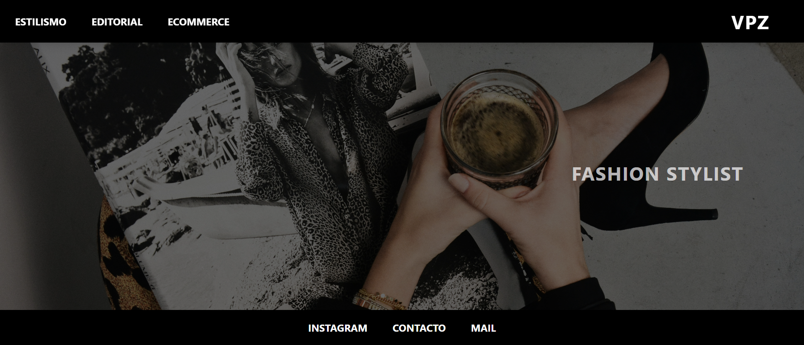

# ✨ Victoria Provisionato Zitta · Portfolio ✨



> **[Ver sitio en producción](https://porfoliovictoriazitta.netlify.app/)**

Este es un **portfolio web profesional** desarrollado para **Victoria Provisionato Zitta**, una Fashion Stylist. El sitio web funciona como una galería digital minimalista y elegante para mostrar su trabajo en tres categorías principales: **Estilismo**, **Editorial** y **Ecommerce**.

---

## 🎯 **Propósito del Proyecto**

El objetivo principal es ofrecer una experiencia visual inmersiva donde las imágenes sean las protagonistas, con un diseño limpio, tipografía editorial y animaciones suaves.

### **Categorías:**
1.  **Estilismo** - Trabajos de estilismo general.
2.  **Editorial** - Producciones editoriales para revistas/medios.
3.  **Ecommerce** - Trabajos para comercio electrónico.

---

## 🛠️ **Tecnologías Utilizadas**

### **Frontend**
-   **HTML5** - Estructura semántica del sitio.
-   **TailwindCSS v4.1.11** - Framework CSS utility-first para estilos modernos.
-   **JavaScript Vanilla** - Lógica de interacción (galerías dinámicas, lightbox, menú responsive).
-   **CSS Personalizado** - Estilos adicionales en `input.css`.

### **Librerías y Optimizaciones**
-   **[@midudev/tailwind-animations](https://github.com/midudev/tailwind-animations)** - Animaciones predefinidas (`animate-slide-down`, `animate-fade-in`).
-   **Optimización de Imágenes** - Uso de formato **WebP** con fallback a JPG/PNG.
-   **Lazy Loading** - Carga diferida nativa (`loading="lazy"`) y asíncrona.

---

## � **Estructura del Proyecto**

```bash
Portfolio-Victoria/
├── assets/
│   ├── fonts/           # Fuentes personalizadas
│   └── img/             # Imágenes optimizadas (WebP + JPG)
│
├── data/
│   └── images.json      # Base de datos JSON de la galería
│
├── js/                  # Scripts lógicos (no usados actualmente, lógica inline)
│
├── node_modules/        # Dependencias NPM
│
├── home.html            # Landing page (Portada)
├── estilismo.html       # Galería principal de Estilismo
├── editorial.html       # Galería de Editorial
├── ecommerce.html       # Galería de Ecommerce
├── contact.html         # Página de Contacto
│
├── input.css            # CSS fuente para Tailwind
├── output.css           # CSS compilado y minificado
│
├── tailwind.config.js   # Configuración de Tailwind
├── package.json         # Dependencias y scripts
└── README.md            # Documentación del proyecto
```

---

## ⚙️ **Funcionamiento del Sistema**

### **1. Galería Dinámica (JSON)**
El contenido de las galerías se carga dinámicamente desde un archivo `data/images.json`. Esto permite actualizar las imágenes fácilmente sin modificar el HTML.

-   **Carga:** JavaScript lee el JSON y detecta la página actual.
-   **Renderizado:** Genera elementos `<picture>` optimizados.
-   **Animación:** Usa `IntersectionObserver` para mostrar las imágenes con un efecto _fade-in_ al hacer scroll.

### **2. Sistema Lightbox**
Permite ver las imágenes en pantalla completa con alta calidad.
-   **Navegación:** Cierre con botón, tecla `ESC` o click fuera de la imagen.
-   **Transiciones:** Animaciones suaves de apertura y cierre.

### **3. Optimización**
-   **Formato WebP:** Reducción de tamaño (~30%) manteniendo calidad.
-   **Lazy Loading:** Solo carga las imágenes visibles para mejorar el tiempo de carga inicial.
-   **Estilos Críticos:** Tailwind genera un CSS purgado que solo incluye las clases utilizadas.

---

## ⚡ **Instalación y Desarrollo**

Si deseas ejecutar este proyecto localmente:

1.  **Clona el repositorio:**
    ```bash
    git clone https://github.com/GianBordon/portfolio-victoria.git
    cd portfolio-victoria
    ```

2.  **Instala dependencias:**
    ```bash
    npm install
    ```

3.  **Ejecuta el compilador de estilos (modo watch):**
    ```bash
    npm run build:styles
    ```
    Esto ejecutará `npx @tailwindcss/cli` para observar cambios en `input.css` y HTML.

4.  **Abre el proyecto:**
    Abre `home.html` en tu navegador o usa una extensión como "Live Server" en VS Code.

---

## 🎨 **Diseño y Estilo**

-   **Paleta:** Blanco y Negro (Minimalismo) + Acento **Rosa Fucsia (`#ff1493`)**.
-   **Tipografía:** `Playfair Display` (elegancia editorial) + `Sans-Serif` (legibilidad).
-   **Responsive:** Diseño _mobile-first_ con menú hamburguesa fullscreen en dispositivos móviles.

---

## 👨‍ **Créditos**

-   **Desarrollo:** [@gianbordon](https://github.com/GianBordon)
-   **Cliente:** Victoria Provisionato Zitta
-   **Hosting:** Netlify

---

> _Hecho con amor, minimalismo y mucho CSS._ 🖤